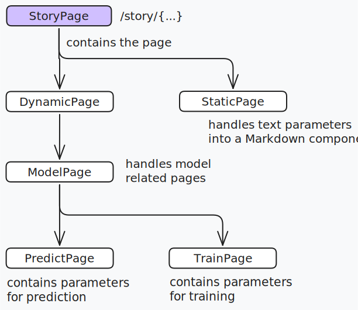

%%[🖋 Edit in Excalidraw](front-end/media/pages.md)%%

Each story is a page, with each story effectively being a SPA by itself - rendering the parts within the story within the same page. The following abstraction above is followed, with the ability to extend when found necessary.